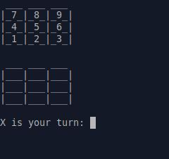
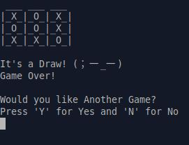

# 🎮 Tic Tac Toe (Ruby Edition)

A classic 2-player Tic Tac Toe game — built with 💎 Ruby and a dash of OOP!  
Play in the terminal, sharpen your logic, and have some fun.

## ✨ Features
- 🎯 Turn-based play for two players
- 🧠 Win and draw detection logic
- 🔁 Replay option after game ends

## 🖼️ Screenshots

